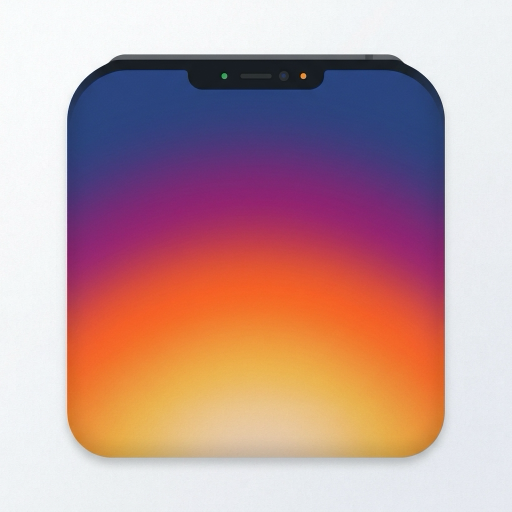

<div align="center">



# MyOwnNotch

**Transforme o notch do seu Mac em uma ilha interativa.**
Player de música, timer, bateria, clima, terminal, Claude e muito mais, tudo a um hover de distância.


</div>

---

## Sobre

O **MyOwnNotch** é um app nativo para macOS, escrito em SwiftUI, que transforma o notch da tela em uma "ilha" dinâmica, inspirada na Dynamic Island do iPhone. Ela fica discreta quando não está em uso, mostra informações compactas (como a música que toca ou o tempo restante do timer) e se expande para um painel completo quando você precisa interagir.

Roda como app de barra de menus, sem ícone no Dock, e flutua acima da menu bar.

## Recursos

| Módulo | O que faz |
| --- | --- |
| 🎵 **Player de música** | Controla Spotify e Apple Music: capa, faixa, progresso, volume e visualizador de áudio. |
| 🎧 **Spotify Connect** | Login OAuth (PKCE), fila "Playing Next", curtir faixa e troca de dispositivos e saída de áudio do Mac. |
| ⏱ **Timer Focus/Break** | Régua deslizante para escolher os minutos e barra de marcas que se apagam durante a contagem. Notificação ao concluir. |
| 🔋 **Bateria** | Nível, estado de carga e detalhes de saúde, lidos via IOKit. |
| 🌤 **Clima** | Temperatura, sensação térmica, umidade, vento e máx/mín, com busca por cidade. |
| 💻 **Terminal** | Shell de login real em PTY (via SwiftTerm), com cores, vim, htop e histórico. A sessão continua viva ao trocar de aba. |
| 🗂 **Bandeja de arquivos** | Solte arquivos no notch para guardá-los e arraste-os de volta para qualquer lugar. |
| ✨ **Claude** | Converse com o Claude pelo CLI `claude` (Claude Code) já instalado e logado. Não precisa de chave de API. Escolha entre Haiku, Sonnet e Opus e ative o modo agente. |
| 📊 **Crypto** | Cotações com variação e minigráfico dos últimos 30 dias. |
| 📈 **Monitor do sistema** | Visão compacta e expandida do uso de CPU. |

## Atalhos do menu

Clique no ícone do app na barra de menus para abrir qualquer módulo:

| Atalho | Módulo |
| --- | --- |
| `M` | Player de música |
| `T` | Timer |
| `B` | Bateria |
| `W` | Clima |
| `X` | Terminal |
| `F` | Bandeja de arquivos |
| `C` | Claude |
| `K` | Crypto |
| `Esc` | Recolher o notch |
| `Q` | Sair |

## Requisitos

- macOS 27 ou superior (deployment target atual do projeto)
- Xcode com suporte a SwiftUI
- *Opcional:* [Claude Code](https://claude.com/claude-code) instalado e logado, para o módulo Claude
- *Opcional:* um Client ID de app Spotify próprio, para fila, curtir faixa e dispositivos

## Como rodar

```bash
git clone <url-do-repositorio>
cd MyOwnNotch
open MyOwnNotch.xcodeproj
```

1. Aguarde o Xcode resolver o pacote [SwiftTerm](https://github.com/migueldeicaza/SwiftTerm) (Swift Package Manager).
2. Selecione o scheme **MyOwnNotch** e rode com `⌘R`.
3. Na primeira execução, autorize o controle do Spotify/Música quando o macOS pedir (permissão de Automação).

> **Sobre o App Sandbox:** ele está desativado de propósito (veja `MyOwnNotch.entitlements`). Isso é necessário para a janela flutuar acima da menu bar, controlar outros apps via AppleScript e ler a bateria via IOKit.

## Estrutura do projeto

```
MyOwnNotch/
├── MyOwnNotchApp.swift        # Entrada do app
├── AppDelegate.swift          # Ícone e menu da barra de menus
├── NotchWindow.swift          # Janela flutuante sobre a menu bar
├── NotchGeometry.swift        # Medidas do notch e tamanhos da ilha
├── NotchViewModel.swift       # Estado central e dados dos módulos
├── NotchContainerView.swift   # Container e troca de módulos
├── MediaControl.swift         # Controle de Spotify / Apple Music
├── SpotifyService.swift       # OAuth PKCE e Web API do Spotify
├── AgentSession.swift         # Integração com o CLI do Claude
├── TerminalSession.swift      # Terminal em PTY (SwiftTerm)
├── *Views.swift               # Interface de cada módulo
└── SharedComponents.swift     # Componentes de UI reutilizáveis
```

## Tecnologias

- **SwiftUI** e **AppKit** para a interface e a janela do notch
- **Combine** para estado reativo
- **IOKit** para bateria, **Network** e **CryptoKit** para o OAuth do Spotify, **Keychain** para os tokens
- **SwiftTerm** para o terminal
- **wttr.in** (clima) e **AwesomeAPI** (cotações)

## Status

Projeto pessoal em desenvolvimento ativo.

---

<div align="center">
<br/>
<sub>Feito com SwiftUI para o seu notch.</sub>
</div>
